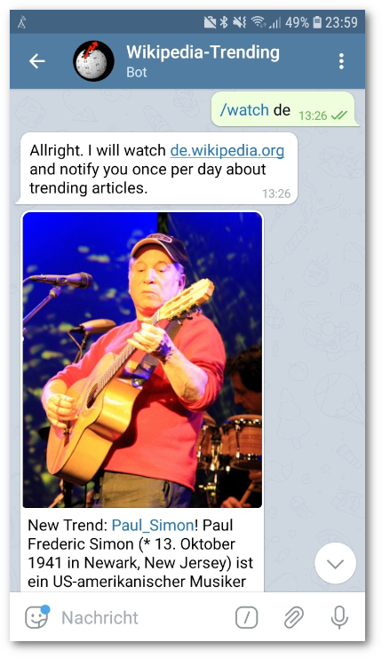

# wikiTrending
Telegram-Bot that notifies about trending pages on Wikipedia.

Inspired by: https://www.youtube.com/watch?v=39nV7f3HZg0

## Demo

 - Try it out by connecting to my instance [@WikiTrendBot](https://t.me/WikiTrendBot)

## Installation

 - create a new bot via Telegram's botfather
 - copy the token into the secrets.env file
 - start the bot with the command `docker-compose up`
 - use your mobile device and write `/start` to your created bot

## Commands

 - */start*: subscribe for daily updates about trending pages on wikipedia
 - */watch xx*: change language by replacing xx with the respective language (xx.wikipedia.org)
 - */stop*: un-subscribe the reports
